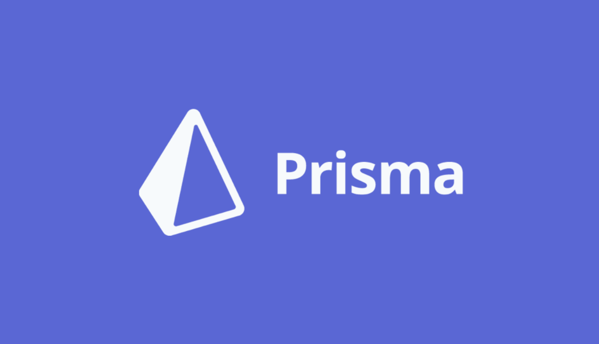

 ## Olá! Eu sou a Danielly ...

 
  
  
  
  
     
  

 
  
  
  
  

 ## 

  <!----
   
 	
  
  -->
  
  
   

  

 ##  🚀 Tecnologias

Mais focada em Front-end / Full-stack

Projetos abaixo teve uso dessas tecnologias :

[Languages]
- Type-script
- Java-script 

[front-end]
- Next
- React
- Redux thunk
- Tailwind

[back-end] 
- Prisma
- Mysql
- Node.js
- MongoDB

[test]
- jest

<!-- 
___
## 💻 Projetos

 click no link para achar sua pagina 

- [Next-13-FullStack ](https://github.com/dany679/TmdbWebSite)
- [Tmdb-react ](https://github.com/dany679/TmdbWebSite)
- [Netflix-react ](https://github.com/dany679/Netflix-React)
- [Memories-Mern-Redux ](https://github.com/dany679/Memories-Mern-React-Redux)
- [Whatssap-react-Next ](https://github.com/dany679/Whatssap-Next-React-) -->

